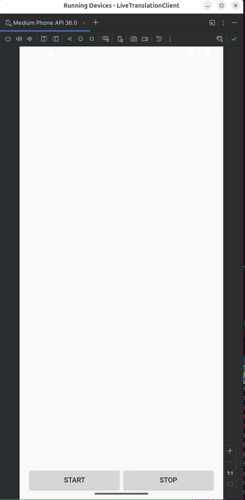

# Kotlin/Android Client

Simple andorid/kotlin app for sending microphone audio to the live-translation server over WebSocket. It streams **raw PCM** audio in real time and logs server responses (transcription and translation).

---

<a href="../../../doc/android.gif" target="_blank">
  
</a>

---

## Features

- Streams audio from the default system microphone
- Streams raw PCM audio in 16-bit, mono, 16kHz format
- Buffers and sends 512-sample (1024-byte) chunks
- Receives and logs transcription and translation from the server
- Simple UI with Start and Stop buttons
- Scrollable log view with color-coded output
---

## Prerequisites

Before running the project, you need to install the following system dependencies:
- [**Android Studio**](https://developer.android.com/studio/install)

---

## Installation

```bash
cd examples/clients/android
```
Open this project, `android`, in **Android Studio** and let it sync the Gradle files.

---

## Usage

- Start [**`server`**](../../../README.md#usage)
- Change the `WEBSOCKET_URL` constant in the `MainActivity.kt` to reflect the **host IP** running the server.
    > **NOTE**: `localhost` doesn't work in emulation environments. **host IP** should be used. 
    >
- If using the **emulator** window, Enable **“Virtual microphone uses host audio input”** in **Extended Controls > Microphone**.
    > **NOTE**: **Extended Controls** is usually the `three dots (⋮)` above the emulator window 
    >
- Run the app

---

## Security Notice
This app enable `cleartext traffic` in the [**AndroidManifest.xml**](./app/src/main/AndroidManifest.xml) via `android:usesCleartextTraffic="true"`.